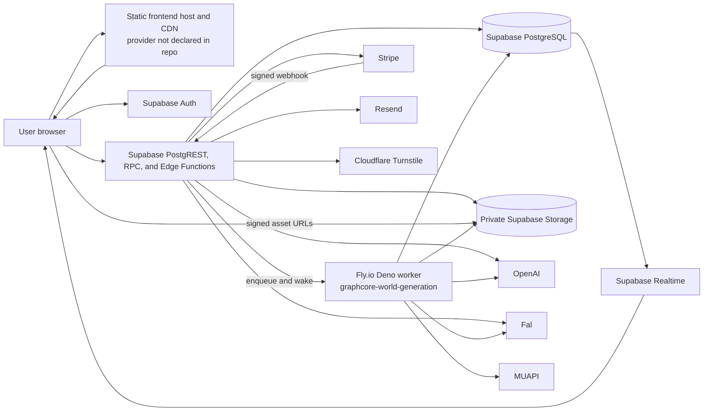

# Synarc Technical Infrastructure Specification

**Status:** Current-state baseline with production target requirements  
**Version:** 0.1  
**Last reviewed:** 2026-08-23  
**Product name:** Synarc  
**Repository / legacy runtime name:** GraphCore

## 1. Purpose

This document describes the technical infrastructure that operates Synarc: the browser applications, cloud services, data platform, background workers, AI and media providers, deployment process, security boundaries, operational controls, and known production-readiness gaps.

It has two kinds of statements:

- **Current** describes behavior or infrastructure evidenced by this repository.
- **Target** defines a production requirement or a recommended next state. It must not be treated as already implemented.

The source of truth for a deployed environment remains the provider configuration in Supabase, Fly.io, the selected frontend host, DNS, and third-party dashboards. This repository does not currently contain a complete inventory of those remote settings.

## 2. System summary

Synarc is a browser-based AI authoring platform. Users create persistent world canon, graphs, media, animatics, documents, and application outputs. Fast authenticated operations run through Supabase APIs and Edge Functions. Long-running or resource-heavy work is persisted as database jobs and executed by a Deno worker on Fly.io. Generated files are stored in private Supabase Storage and accessed through short-lived signed URLs.

The system currently uses:

- React 19, TypeScript, and Vite for the client.
- Supabase Auth, PostgreSQL 17, PostgREST/RPC, Realtime, Storage, and Deno Edge Functions.
- A Deno worker deployed as the Fly.io app `graphcore-world-generation` in `lhr`.
- OpenAI for text/reasoning and direct image generation.
- Fal for queued image/video/media generation, including compatible third-party models.
- MUAPI as a video-generation path.
- Stripe for subscriptions and credit purchases.
- Resend for waitlist confirmation email.
- Cloudflare Turnstile as optional waitlist abuse protection.

## 3. Logical architecture

### 3.1 Trust boundaries

1. **Public browser boundary.** The browser is untrusted. It may hold only publishable Supabase configuration and a user session. It must never receive service-role or provider secrets.
2. **Supabase application boundary.** Row-level security (RLS), authenticated Edge Function handlers, RPC authorization, and Storage policies enforce tenant and project access.
3. **Privileged compute boundary.** Edge Functions and the Fly worker can use service-role credentials. They must independently validate the requesting user or accept only authenticated server-to-server traffic.
4. **Provider boundary.** OpenAI, Fal, MUAPI, Stripe, Resend, and Cloudflare receive only the data needed for the requested operation. Provider callbacks must be authenticated and idempotent.

## 4. Runtime components

| Component | Current implementation | Responsibility | Deployment state |
|---|---|---|---|
| Full web app | Vite + React + TypeScript | Authenticated Synarc authoring UI | Build profile exists; production host is not declared in the repo |
| Landing app | Separate `VITE_APP_PROFILE=landing` Vite build | Public marketing page and waitlist | Build is pruned to landing/brand assets; intended canonical origin is `https://synarc.ai` |
| API/data plane | Hosted Supabase project | Auth, relational data, RPC, Realtime, Storage, Edge Functions | Hosted project is documented and linked; remote plan/region/settings are not codified |
| Edge compute | Supabase Deno 2 Edge Functions | Interactive orchestration, validation, webhooks, signing, job creation, billing | Function source and partial local config are checked in |
| Durable compute | Fly.io Deno container | World generation, visual jobs, output workflows, app generation, PDF/media processing | App/config checked in; one minimum machine configured in London |
| AI/media providers | OpenAI, Fal, MUAPI | Text, reasoning, images, video, meshes/media | Selected by server-side configuration and job metadata |
| Payments | Stripe | Checkout, subscriptions, credit purchases, webhook reconciliation | Functions exist; complete billing schema is not represented by migrations in this repo |
| Transactional email | Resend | New waitlist signup confirmation | Optional, best effort |
| Abuse prevention | Origin allowlist, DB throttling, honeypot, optional Turnstile | Protect public waitlist submission | Implemented in `join-waitlist`; production configuration is external |

## 5. Frontend infrastructure

### 5.1 Build profiles

Synarc produces two static application profiles from one codebase:

- `full`: loads the authenticated authoring application.
- `landing`: dynamically loads only the landing application, audits landing assets, prunes the output, and writes production SEO assets.

The public URL, Supabase URL, and publishable keys are build-time `VITE_*` variables. Because Vite embeds these values in the browser bundle, no `VITE_*` value may be treated as secret.

### 5.2 Hosting and DNS

**Current:** The repository does not contain a Vercel, Netlify, Cloudflare Pages, or equivalent production-host configuration. `synarc.ai` is the intended public origin, but the actual hosting provider, DNS zone, TLS configuration, cache policy, redirects, preview environments, and deployment linkage cannot be verified from source.

**Target:** The selected frontend host must provide:

- TLS 1.2 or newer and automatic certificate renewal.
- CDN delivery for immutable hashed assets.
- SPA fallback routing for application routes.
- Separate full-app and landing deployments or an explicitly tested routing arrangement.
- Environment-scoped variables for development, preview/staging, and production.
- Security headers: CSP, HSTS, `X-Content-Type-Options`, `Referrer-Policy`, and an appropriate frame policy.
- Atomic deploys and a tested rollback to the preceding build.

## 6. Supabase platform

### 6.1 Hosted project

The checked-in operations guide identifies one hosted Supabase project:

- Project name: `GraphCore`
- Project reference: `znwdatidqdkzidempvkt`
- API origin: `https://znwdatidqdkzidempvkt.supabase.co`

The project reference and publishable key are public identifiers. Service-role keys and provider credentials are secrets.

**Current gap:** There is no separately codified staging project. Region, compute size, database connection limits, point-in-time recovery, log drains, custom domains, and production network restrictions are also not represented in source.

### 6.2 Database

PostgreSQL is the canonical state store. Local configuration targets PostgreSQL 17. Migrations define the application model and database-side queue primitives.

Major data groups include:

- tenancy: workspaces, memberships, projects, drafts, and user workspace state;
- authored content: definitions, components, graphs, nodes, edges, world entities, relationships, views, threads, and releases;
- generation queues: world-generation jobs and steps, visual jobs, output workflow runs and steps, app-generation jobs, cinematic jobs, and mesh jobs;
- output state: output requests, status projections, events, workflow graphs, and artifacts;
- operations and finance: audit events, AI usage events, pricing catalog, and waitlist audit/throttle events.

RLS is enabled on application tables and is backed by helper functions that test workspace/project membership and edit rights. Privileged queue claim/complete/fail operations run through service-role code and database functions. Queue claims use transactional locking patterns, including `FOR UPDATE SKIP LOCKED`, to allow multiple workers without double-claiming a row.

### 6.3 API and Edge Functions

The browser uses Supabase PostgREST/RPC for authorized data access and Edge Functions for orchestration that needs secrets, elevated access, provider calls, or multi-row operations.

Most application-facing functions are configured with gateway `verify_jwt = false` and call the shared `requireUserClient()` helper themselves. That helper validates the bearer token using `auth.getUser()` and then constructs a user-scoped client so RLS still applies. Functions that need privileged writes call `requireAuthedAdminClient()` only after user validation.

This is an intentional application-auth pattern, but every public function must be reviewed individually. `verify_jwt = false` means the platform gateway is not the enforcement point.

Functions fall into these families:

- workspace bootstrap, snapshot, patch, and release operations;
- prompt intent, world seed, canon update, and world-build orchestration;
- output planning, workflow commands, status, cancellation, and artifact delivery;
- cinematic and sequence-animatic orchestration;
- visual, mesh, and app-generation job control;
- private-asset signing;
- Stripe checkout/subscription and webhooks;
- Fal and MUAPI webhooks;
- public waitlist and health checks.

### 6.4 Realtime and polling

Supabase Realtime publishes database changes for prompt turns, generation events, output workflows, cinematic runs, and animatic state. The client combines Realtime notifications with bounded polling and reconciliation so transient websocket loss does not lose durable progress.

Client requests pass through a coordinator that:

- coalesces identical idempotent reads;
- limits concurrency by request class;
- serializes mutations by resource key;
- groups and bounds status polls;
- preserves stale-but-valid local data when signing or status calls fail.

### 6.5 Object storage

Generated assets are stored in private Supabase Storage buckets:

- `project-assets` for project media and generated files;
- `release-bundles` for published release artifacts.

The `project_assets` table is the durable metadata/index layer. Browser access is through authenticated policy checks or short-lived signed URLs produced by the signing endpoint. Workers download provider results, upload them to Storage, upsert metadata, and only then mark the corresponding job complete.

## 7. Fly.io durable worker

### 7.1 Deployment topology

The checked-in production-style configuration is:

| Setting | Value |
|---|---|
| Fly application | `graphcore-world-generation` |
| Primary region | `lhr` |
| Process | One mixed Deno worker process |
| VM | 1 shared CPU, 2 GB RAM |
| Minimum machines | 1 |
| Auto-stop | Off |
| Auto-start | On |
| Internal HTTP port | 8080 |
| HTTPS | Forced by Fly service |
| Graceful shutdown window | 300 seconds |
| Visual lanes | 2 in checked-in Fly config |
| Output-workflow lanes | 1 in checked-in Fly config |

The container is based on `denoland/deno:alpine` and installs Chromium, fonts, FFmpeg, and native libraries. These support PDF rendering, browser-based document rendering, image processing, and media assembly.

### 7.2 Worker responsibilities

One process runs independent loops for:

- world/prompt generation jobs;
- visual-generation jobs;
- output workflow runs;
- application-generation jobs;
- stale-work maintenance and recovery.

The database is the queue and source of truth. Edge Functions create durable work rows and can send a best-effort HMAC-signed request to `/internal/wake`. If wake delivery fails, adaptive polling recovers the job. `/health` exposes basic worker identity and circuit state.

### 7.3 Reliability behavior

The worker provides:

- row-locked job claims and worker IDs;
- heartbeats, stale-lease recovery, cancellation checks, and idempotent completion paths;
- immediate requeue of claimed output workflows during graceful shutdown;
- provider timeouts, retry/backoff, and persisted provider request IDs;
- a database circuit breaker with progressively longer backoff;
- adaptive active/idle polling with jitter;
- job progress persisted to PostgreSQL for UI recovery.

**Current constraint:** The worker is a single mixed pool with one minimum machine. CPU-heavy media work, provider-bound media work, and LLM planning compete within the same VM and deployment. The existing scalability roadmap proposes separate planning, asset, video, and world/app pools when queue pressure justifies it.

## 8. Core request flows

### 8.1 Interactive authenticated request

1. The browser obtains a Supabase Auth session.
2. It calls PostgREST/RPC or invokes an Edge Function with the bearer token.
3. RLS or `requireUserClient()` verifies identity and authorization.
4. The operation reads or mutates project-scoped rows.
5. Realtime notifies interested clients; the client reconciles with a bounded refresh.

### 8.2 Durable AI/media job

1. An authenticated Edge Function validates project access and input.
2. It reserves logical output rows and inserts a queued job/run.
3. It sends a best-effort signed worker wake request.
4. The Fly worker transactionally claims the job.
5. The worker calls the configured provider and persists request IDs, progress, usage, and pricing metadata.
6. Provider webhooks or worker polling obtain the terminal provider result.
7. The worker downloads and validates media, uploads it to private Storage, updates the asset binding, and marks the job terminal.
8. Realtime and polling update the browser.

### 8.3 Payments

1. An authenticated Edge Function creates a Stripe checkout session.
2. The browser redirects to Stripe-hosted checkout.
3. Stripe sends a signed webhook to the public webhook function.
4. The webhook idempotently reconciles purchases/subscriptions and grants credits.

**Current gap:** Stripe functions reference `credit_packages`, `credit_purchases`, and `subscriptions`, but migrations creating those tables are not present in this repository. Before a reproducible deployment, the remote schema must be captured as migrations and the functions' legacy `graphcore.ai` fallback URLs must be changed to environment-driven Synarc URLs.

### 8.4 Public waitlist

The landing build calls only `join-waitlist`. The function applies an origin allowlist when configured, a honeypot, database-backed IP/email throttling, optional Turnstile validation, and service-role-only writes. New signups may receive a best-effort Resend confirmation email. The waitlist can later move to a dedicated Supabase project without changing application code.

## 9. External service integrations

| Service | Data/purpose | Authentication | Completion model |
|---|---|---|---|
| OpenAI | Prompts, world canon, structured plans, images | Server-side API key | Synchronous or background response polling |
| Fal | Images, video, and compatible media models | Server-side API key | Queue request plus signed webhook/polling fallback |
| MUAPI | Seedance/video generation | Server-side API key | Provider request plus shared-secret webhook/polling |
| Stripe | Checkout, subscriptions, credit purchases | Secret key and webhook signing secret | Signed webhook is financial source of truth |
| Resend | Waitlist confirmation email | Server-side API key | Best-effort HTTP response |
| Cloudflare Turnstile | Public form abuse challenge | Public site key + server secret | Server-side token verification |

AI usage is normalized into `ai_usage_events` with provider/model identifiers, workflow/job links, usage payloads, pricing snapshots, estimated or actual USD, and charged credits. Idempotency keys prevent duplicate ledger writes.

## 10. Configuration and secrets

### 10.1 Browser-safe variables

- `VITE_APP_PROFILE`
- `VITE_PUBLIC_SITE_URL`
- `VITE_SUPABASE_URL`
- `VITE_SUPABASE_PUBLISHABLE_DEFAULT_KEY`
- `VITE_WAITLIST_SUPABASE_URL`
- `VITE_WAITLIST_SUPABASE_PUBLISHABLE_KEY`
- `VITE_WAITLIST_FUNCTION_NAME`
- `VITE_WAITLIST_TURNSTILE_SITE_KEY`

### 10.2 Privileged secrets

At minimum, server environments may require:

- Supabase: `SUPABASE_URL`, `SB_SECRET_KEY` or `SUPABASE_SERVICE_ROLE_KEY`, and `SB_PUBLISHABLE_KEY` or `SUPABASE_ANON_KEY`.
- AI/media: `OPENAI_API_KEY`, `FAL_KEY`, and `MUAPI_KEY` when those paths are enabled.
- Worker control: `GRAPHCORE_WORKER_SECRET` and `GRAPHCORE_WORKER_WAKE_SECRET`.
- Webhooks: provider-specific signing or shared secrets, including Stripe and MUAPI secrets.
- Waitlist/email: `RESEND_API_KEY`, `WAITLIST_RATE_LIMIT_SALT`, and optional `WAITLIST_TURNSTILE_SECRET_KEY`.

Model names, timeouts, concurrency, quality, output formats, provider routing, and debug flags are configuration rather than secrets, but should still be environment-scoped and change-controlled.

### 10.3 Secret-management rules

- Keep browser values in host build settings and local ignored `.env*` files.
- Keep Edge Function secrets in Supabase secrets.
- Keep worker secrets in Fly secrets.
- Never copy service-role or provider credentials into `VITE_*` values, logs, artifacts, or database metadata.
- Rotate secrets after suspected disclosure and on a defined schedule.
- Use separate credentials per environment and least-privilege provider keys where supported.

## 11. Security controls

### 11.1 Controls evidenced in source

- Supabase Auth bearer-token validation for user-facing privileged operations.
- RLS and workspace/project membership helpers.
- Private Storage buckets and signed asset access.
- Service credentials confined to server runtimes.
- HMAC-signed worker wake requests with timestamp expiry.
- Fal signature verification, MUAPI webhook secret validation, and Stripe webhook signature validation.
- Idempotent job and webhook processing.
- Public waitlist throttling, honeypot, origin controls, and optional Turnstile.
- Input schemas and structured-output validation with Zod.

### 11.2 Required hardening

- Replace the shared wildcard CORS policy with an environment-specific allowlist for authenticated functions.
- Maintain an inventory proving that every `verify_jwt = false` endpoint performs its own appropriate authentication or signature validation.
- Enable and document production database network restrictions and SSL policy where compatible with Supabase-managed access.
- Configure production email confirmation/MFA policy according to product requirements; local defaults are not a production security specification.
- Add dependency, secret, and static-analysis scanning to CI.
- Define retention/deletion rules for prompts, generated media, provider payloads, audit logs, and account deletion.
- Complete a data-processing review for every AI/media provider, including regional transfer and model-training controls.
- Prevent raw prompt or provider logs from capturing credentials or unnecessarily sensitive user content.

## 12. Reliability, scale, and disaster recovery

### 12.1 Current characteristics

- PostgreSQL job rows provide durable queue state.
- Realtime is an acceleration path; polling and persisted events provide recovery.
- Worker claims, heartbeats, stale reclaim, cancellation, and idempotency handle common interruption modes.
- The Fly worker always keeps at least one machine running.
- Provider calls use timeouts and retry behavior appropriate to long-running generation.

### 12.2 Target service objectives

The following are initial targets and require production measurement before adoption:

| Measure | Proposed target |
|---|---|
| Authenticated API availability | 99.9% monthly, excluding declared provider degradation |
| Job acceptance | 99.9% of valid requests durably queued within 10 seconds |
| Queue recovery | No acknowledged job lost after worker restart/deploy |
| Interactive p95 latency | Under 2 seconds for non-generation application operations |
| Realtime recovery | UI reconciles durable state within 30 seconds after missed events |
| Backup RPO | 24 hours minimum; 1 hour preferred for production |
| Service RTO | 4 hours initially |

### 12.3 Scaling path

1. Measure queue depth, oldest queued age, provider throttling, CPU, memory, and failure/retry rates.
2. Add Fly machines while retaining conservative per-machine concurrency.
3. Split planning, visual/asset, video, and world/app work into independently scaled worker pools.
4. Autoscale from queue pressure with provider-specific global concurrency governors.
5. Consider a dedicated workflow platform only after the Postgres queue becomes an evidenced bottleneck.

### 12.4 Disaster-recovery gaps

**Current:** Backup tier, PITR, restore drills, cross-region strategy, Storage replication, lifecycle policy, and formal RPO/RTO ownership are not codified.

**Target:** Record the Supabase backup/PITR plan, run and evidence restore drills, define Storage recovery expectations, export critical configuration, and keep a tested runbook for replacing a Fly machine and rolling back application/function/database releases.

## 13. Observability and operations

### 13.1 Current telemetry

- Supabase function logs and Fly application logs.
- `/health` on the Fly worker.
- Durable job/run state, progress events, error messages, diagnostics, and heartbeats in PostgreSQL.
- `audit_events` for application audit history.
- `ai_usage_events` for AI usage and cost attribution.
- Provider request/response IDs stored with jobs for investigation.

### 13.2 Current gaps

No centralized APM/error tracker, metrics backend, distributed tracing, dashboard definitions, alert rules, or external uptime checks are configured in this repository. There is also no explicit log retention or redaction policy.

### 13.3 Target monitoring

At minimum, production monitoring should alert on:

- frontend and Edge Function availability;
- Fly worker health and machine count;
- oldest queued age and queue depth by job family;
- running jobs with stale heartbeats;
- provider 429/5xx rates and timeout rates;
- webhook signature failures and callback backlog;
- database saturation, slow queries, storage growth, and Realtime errors;
- failed Stripe webhook processing or credit-ledger divergence;
- daily provider spend and unusual per-user/project spend.

Logs should include a correlation chain of project, request/job, workflow/run, step, provider request, and worker IDs without logging credentials.

## 14. Deployment and change management

### 14.1 Current delivery model

- Frontend: TypeScript/Vite builds exist, but the production hosting/deploy pipeline is not checked in.
- Database: ordered Supabase SQL migrations, applied with `supabase db push`.
- Edge Functions: deployed individually with the Supabase CLI.
- Worker: built remotely from the checked-in Dockerfile and deployed with `npm run fly:worker:deploy`.
- CI/CD: no `.github/workflows` or equivalent pipeline is present in the repository; delivery appears manual.

### 14.2 Required verification

Every application change must pass:

1. `npx tsc --noEmit`
2. `npm run build`
3. `npm run test` when affected behavior has tests
4. `npm run dev` startup smoke test with no startup/runtime console errors

Database changes must be migration-driven and tested on a disposable/local database before production. Edge Functions must be listed and gateway-tested after deploy.

### 14.3 Paired Supabase/Fly deployment rule

Code shared between Edge Functions and `workers/world-generation/main.ts` must be deployed to both runtimes. This includes relevant files under `supabase/functions/_shared`, output workflow factories/handlers, provider/image helpers, and imported `src/domain` modules.

When command handlers or `_shared/workflow-command-handlers.ts` change, deploy `start-workflow-command` as well as any direct compatibility endpoint. Otherwise, Edge may create new workflow rows while an old Fly image executes them.

### 14.4 Target CI/CD gates

A production pipeline should:

1. install from the lockfile;
2. run type checking, tests, and both relevant build profiles;
3. scan dependencies and secrets;
4. verify migration ordering and generate a schema-drift report;
5. deploy to staging;
6. run API, auth, Realtime, Storage, worker, and provider-stub smoke tests;
7. require approval for production database/function/worker changes;
8. deploy frontend, Edge Functions, and Fly images with recorded versions;
9. run post-deploy health and queue checks;
10. retain a documented rollback path.

## 15. Environments

| Environment | Current state | Required isolation |
|---|---|---|
| Local | Vite plus local Supabase/Docker supported | Local keys, local database, optional provider sandbox keys |
| Hosted development | One shared hosted Supabase project is documented | Must not be assumed equivalent to production |
| Staging | Not codified | Separate Supabase project, Fly app, Storage, Stripe mode, provider keys, and frontend origin |
| Production | Public origin is intended as `synarc.ai`; full topology is not codified | Dedicated credentials, backups, monitoring, budgets, access control, and change approvals |

Production and staging must not share service-role keys, webhook secrets, Storage buckets, payment mode, or user data.

## 16. Data lifecycle and compliance requirements

**Current gap:** Repository code demonstrates access controls but does not define a complete privacy, retention, regional-processing, export, or deletion policy.

Before general availability, Synarc must define:

- data classification for identity, prompts, world canon, uploaded references, generated media, billing data, and logs;
- retention periods for active projects, deleted projects, failed jobs, provider payloads, signed URLs, events, and audit records;
- account/project export and irreversible deletion workflows;
- provider subprocessors and whether customer content may be retained or used for training;
- UK/EU data-transfer and data-processing terms where applicable;
- access-review, incident-response, breach-notification, and legal-hold procedures.

## 17. Known risks and open decisions

| Priority | Item | Required decision/action |
|---|---|---|
| P0 | Billing schema cannot be reproduced from checked-in migrations | Capture remote billing tables, functions, grants, RLS, and seed packages as migrations before relying on a fresh environment |
| P0 | Production frontend host and deploy pipeline are not codified | Select/document provider, DNS, TLS, headers, build profiles, environments, and rollback |
| P1 | One shared hosted Supabase project is documented | Establish isolated staging and production projects or explicitly record the accepted beta posture |
| P1 | Most Edge Functions bypass gateway JWT verification | Complete endpoint-by-endpoint auth/signature audit and automate checks |
| P1 | Wildcard CORS is shared by authenticated functions | Introduce environment-aware origin policy |
| P1 | Single mixed Fly worker pool | Define capacity threshold and scaling runbook; split pools when queue contention appears |
| P1 | No centralized monitoring/alerting in repo | Select observability stack and add service, queue, spend, and billing alerts |
| P1 | Backup/PITR and restore process unknown | Select plan, document RPO/RTO, and run a restore drill |
| P2 | `graphcore.ai` fallback URLs remain in Stripe code | Replace with validated environment-driven Synarc application URLs |
| P2 | Brand/runtime naming is mixed | Keep a mapping during migration and avoid renaming database/runtime identifiers without a migration plan |
| P2 | No infrastructure-as-code for the complete stack | Codify frontend, DNS, Fly scaling, environment inventory, and provider settings where provider tooling allows |

## 18. Production acceptance checklist

Synarc infrastructure is ready for production only when:

- [ ] The frontend host, DNS, TLS, security headers, build profiles, and rollback are documented and tested.
- [ ] Development, staging, and production credentials and data are isolated.
- [ ] A fresh database can be created entirely from checked-in migrations and seeds, including billing.
- [ ] RLS and every public Edge Function have automated authorization tests.
- [ ] Private assets cannot be retrieved across workspaces and signed URLs expire as intended.
- [ ] Stripe, Fal, and MUAPI webhook signature/idempotency tests pass.
- [ ] Fly worker restart, deploy handoff, stale reclaim, and cancellation are exercised end to end.
- [ ] Queue capacity, provider concurrency, spend limits, and overload behavior are defined.
- [ ] Backups/PITR are enabled as required and a restore drill has succeeded.
- [ ] Central monitoring, alert routing, log retention, and redaction are operational.
- [ ] Privacy, deletion, retention, subprocessor, and incident-response policies are approved.
- [ ] Type checking, tests, builds, dev startup, and post-deploy smoke tests run in CI/CD.

## 19. Repository references

This specification was derived from:

- `package.json` and `vite.config.ts`
- `src/config`, `src/data`, and the application adapters
- `supabase/config.toml`, migrations, and Edge Functions
- `workers/world-generation` and `fly.world-generation.toml`
- `Agents.md`
- `docs/09-current-architecture.md`
- `docs/10-current-data-model.md`
- `docs/13-supabase-edge-function-runbook.md`
- `docs/14-supabase-project-operations.md`
- `docs/23-supabase-db-performance-and-security-runbook.md`
- `docs/scaling/animatic-worker-scalability.md`
